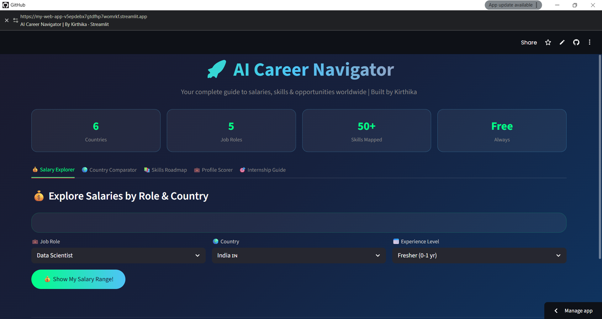
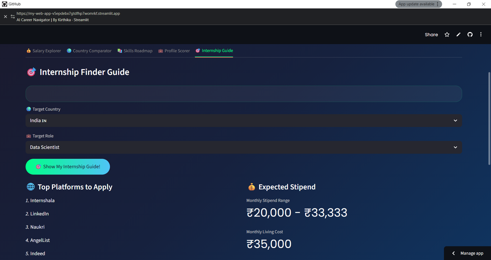

##screenshot

# 🚀 AI Career Navigator

*By Kirthika | AI & Data Science Student*

## 🌐 Live Demo
[Click here to try the app!](https://my-web-app-v5epdebx7gtdfhp7womrkf.streamlit.app/)

## 📌 About
A complete AI-powered career guidance web application that helps 
students and professionals worldwide explore salaries, plan their 
skills roadmap and find internship opportunities!

## 🎯 Features

### 💰 Salary Explorer
- Real salary ranges for 5 job roles
- 6 countries with local currency
- Experience level multipliers
- Monthly savings calculator

### 🌍 Country Comparator  
- Compare salaries across all countries
- Visual charts and detailed tables
- Cost of living vs salary analysis

### 📚 Skills Roadmap
- Exact skills needed for each role
- 6 month learning plan
- Must-have vs good-to-have skills

### 💼 Profile Scorer
- Score your career readiness out of 100
- Personalized feedback
- Score breakdown chart

### 🎯 Internship Guide
- Top platforms by country
- Expected stipend ranges
- Application checklist

## 🌍 Supported Countries
| Country | Currency |
|---------|----------|
| India 🇮🇳 | ₹ INR |
| Germany 🇩🇪 | € EUR |
| Singapore 🇸🇬 | S$ SGD |
| USA 🇺🇸 | $ USD |
| UK 🇬🇧 | £ GBP |
| Canada 🇨🇦 | CA$ CAD |

## 💼 Supported Job Roles
- Data Scientist
- ML Engineer
- Data Analyst
- AI Engineer
- Software Engineer

## 🛠️ Technologies Used
- Python
- Streamlit
- Pandas
- Matplotlib
- NumPy
- Scikit-learn

## 🚀 How to Run Locally
pip install streamlit pandas numpy matplotlib scikit-learn
streamlit run app.py

## 👩‍💻 Author
Kirthika | B.Tech AI & Data Science | Final Year
Looking for AI/ML internship opportunities abroad
🌍 Building tools that help people navigate their careers!
